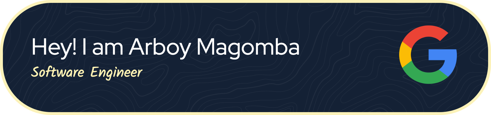

<!-- # Arboy Magomba |  Software Engineer -->

<!-- Typing Header -->

<!-- Optional avatar / gif -->
<!--  -->

<!-- Social badges -->

  
  <!--  -->
  
  

<h3>
  Building systems that are user intuitive, scalable and performant under pressure ⚡
</h3>

---

## 🚀 About Me

I’m a **Software Engineer** and CS Major at the **University of Oklahoma**, returning to **Google** full-time in 2027. Most recently, I completed a **Software Engineering Internship at Google Cloud** (Summer 2026) on the **Data Protection** team, where I worked on enterprise data security UI modernization and telemetry pipelines for the **Google Admin Console**.

I love building systems and products that are used to solve real world problems at scale. I'm particularly interested in **real-time data**, **serverless pipelines**, and **production constraints**.

- 🧠 **Core interests:** Product-facing Work, Cloud Infrastructure, Applied AI and Distributed backend systems.
- 🎓 **Education:** Accelerated B.S. / M.S. in Computer Science at the **University of Oklahoma**.
- 🏗️ **I care about:** Performant and Scalable Systems designs, Bridging low-latency backend systems with intuitive consumer interfaces, optimistic UI architecture, and shipping at high velocity.
- 🧰 **Personal hobbies:** F1 Racing (everything racing), Go Karting, Video Games, and building cool stuff.

---

## 🧠 What I’m optimizing for (my “engineering loop”)

- **Simple interfaces** → strong invariants → measurable performance
- Build the **minimum** that ships, then iterate with instrumentation
- Prefer **boring tech** for the core, and **sharp tools** at the edges (AI, streaming, UX polish)

---

## 💻 Tech Stack

| Category | Stack |
|---|---|
| **Languages** |       |
| **Frameworks & UI** |      |
| **Cloud Infra & DevOps** |       |
| **AI/ML** |      |
| **Database** |      |
| **Tools & Design** |       |

---

## 🚀 My Experience

| Company | Role | Stack | Key Achievements |
| --- | --- | --- | --- |
| **Google** | Software Engineering Intern | TypeScript, Material Design 3, gRPC, Protocol Buffers, Jasmine, Java | Modernized the core rule-creation engine for the **Data Security** team in **Google Admin Console**, refactoring legacy JS to **TypeScript + Material Design 3** to reduce technical debt by **30%**. Profiled client-to-server data pipelines (TTI/FCP) to cut enterprise render times by **15%**. Integrated **LLM-driven evaluation** over **gRPC/Protobuf** streaming with feature flags and **100% test coverage** across Gmail, Chat, Meet, and Drive. |
| **Metron Analytics LLC** | Software Engineering Intern | Python, FastAPI, AWS (Lambda, EventBridge, DynamoDB, S3, EC2), PostgreSQL (Supabase), Neon | Migrated the live sports prediction backend from **FastAPI/Railway** to an **event-driven AWS serverless architecture**, sustaining **99.9% uptime** during live spikes. Split workload into **Batch Training (S3/EC2)** and **Real-Time Inference (Lambda/DynamoDB)**, cutting latency **50%**. |
| **K20 Educational Research Center** | Software Engineer Intern | TypeScript, React, AdonisJS, PostgreSQL, Docker, Kubernetes (GKE), WebSockets | Developed an enterprise platform using **React + AdonisJS + Postgres**, tuning connection pooling to reduce **p95 latency by 40%**. Deployed containerized microservices on **GKE** with **WebSocket token-streaming**, cutting end-to-end response times by **60%**. |
| **Sooner Competitive Robotics** | Software Engineer Intern | Python, C++, Linux, TensorFlow, PyTorch | Built real-time concurrent robot navigation and control modules in **Python/C++**, contributing to a **1st-place finish**. Implemented telemetry-based sensor tuning, raising navigation precision by **30%**. |

---

## 🏆 Featured Projects

| Project | Role | Stack | Key Achievements |
| --- | --- | --- | --- |
| **[Echoes](https://github.com/arboydev27/echoes-ios-app)** | Lead iOS & ML Developer | Swift, SwiftUI, Vision, SFSpeechRecognizer, SwiftData, CoreML, CoreHaptics | Developed an on-device accessibility and journaling iOS app for the **Apple Swift Student Challenge**. Integrated **Vision facial tracking** and real-time **SFSpeech audio transcription** with on-device **CoreML sentiment analysis** for private, zero-latency affective feedback. |
| **[Pitchly](https://github.com/Pitchly-io)** | Full-Stack Engineer | Next.js, TypeScript, Python, FastAPI, WebSockets, OpenAI API, TailwindCSS | Built an AI-driven mock interview platform that conducts conversational behavioral/technical screeners. Implemented token-streamed audio/text analysis over **WebSockets** with instant scoring heuristics and feedback telemetry. |
| **[QuickNews.ai](https://github.com/arboydev27/quicknews-ai)** | Full-Stack Developer | JavaScript, Next.js, AWS Lambda, API Gateway, CloudWatch, AWS Comprehend | Shipped a **Next.js** platform powered by **AWS serverless APIs** for dynamic news extraction and sentiment analysis. Configured **Provisioned Concurrency** to slash median execution latency from **~2.0s down to ~200ms (10x reduction)**. |

---

## 📊 GitHub Stats

  <!-- Detailed stats card (generated by GitHub Actions) -->
  

---

## 📈 Activity

<!-- Snake animation (needs a GitHub Action in your repo) -->

  <picture>
    <source media="(prefers-color-scheme: dark)" srcset="https://raw.githubusercontent.com/arboydev27/arboydev27/output/github-contribution-grid-snake-dark.svg">
    <source media="(prefers-color-scheme: light)" srcset="https://raw.githubusercontent.com/arboydev27/arboydev27/output/github-contribution-grid-snake.svg">
    
  </picture>

---

## 🤝 Let’s Connect

If you're building **performance-critical systems**, **developer tools**, or **AI infrastructure**, I’m always down to talk.

 
<!--  -->

